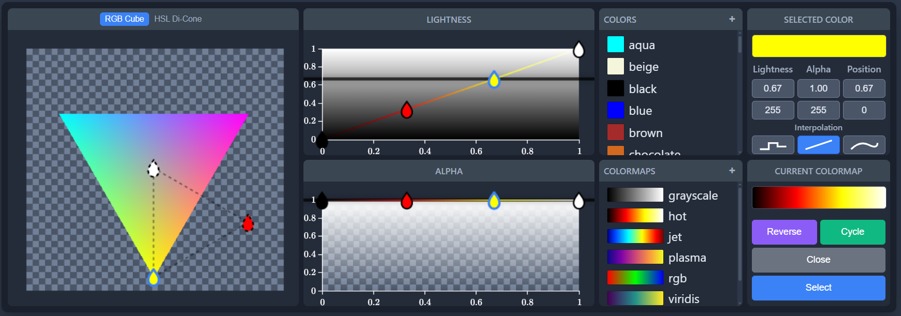

# Colormap Selector

A professional, standalone JavaScript component for creating and editing colormaps and color gradients. This component is self-contained, creates its own UI, and can be used as a popup in any web application. It offers a rich interface for manipulating color points in both RGB and HSL color spaces with advanced features like cyclic colormaps and multiple interpolation modes.



## Features

- **Dual Color Spaces**: Edit colors in either RGB Cube or HSL Di-Cone space with seamless switching
- **Interactive UI**: Drag-and-drop points to adjust color, lightness, alpha, and position
- **Multiple Interpolation Modes**: Constant, linear, and cubic spline interpolation between points
- **Cyclic Colormaps**: Enable cycling to create seamless looping gradients
- **Undo/Redo**: Full support for undo and redo actions (`Ctrl+Z` / `Ctrl+Y`)
- **Preset Management**: Load named presets and create, save, rename, or delete your own custom colors and colormaps
- **Smart Point Selection**: Single, double, and triple-click selection with modifier key support
- **Self-Contained**: Creates its own DOM elements and can be injected into any page as a popup
- **No Dependencies**: Written in pure JavaScript with no external libraries required

## Installation

This package is designed to be installed directly from its GitHub repository using npm.

In your project's terminal, run the following command:

```bash
npm install github:svenviktorjonsson/colormap-selector
```

This will add the package to your `node_modules` folder and list it in your `package.json` dependencies.

## Usage

To use the Colormap Selector, you need to import the class and its corresponding stylesheet. Then, you can create an instance and call its `show()` method, typically in response to a user action like a button click.

### HTML Setup

First, ensure you have an element in your HTML to trigger the color picker.

```html
<!DOCTYPE html>
<html>
<head>
    <title>Colormap Selector Example</title>
    <!-- Link to the component's stylesheet -->
    <link rel="stylesheet" href="node_modules/colormap-selector/styles.css">
</head>
<body>
    <button id="open-editor-button">Open Colormap Editor</button>

    <!-- Link to your application's script -->
    <script type="module" src="app.js"></script>
</body>
</html>
```

### JavaScript Implementation

In your main application script (`app.js`), import and initialize the component.

```javascript
import ColormapSelector from 'colormap-selector';

// Wait for the DOM to be ready
document.addEventListener('DOMContentLoaded', async () => {
    
    // 1. Create a single instance of the editor for your application.
    const colorEditor = new ColormapSelector();

    // 2. Initialize the editor. This is an async operation that builds the UI
    //    and loads the necessary color preset files.
    //    It's crucial to `await` this call.
    await colorEditor.initialize();

    // 3. Add the editor's main element to your page's body.
    document.body.appendChild(colorEditor.getElement());

    // 4. Set up an event listener to show the editor.
    const openEditorButton = document.getElementById('open-editor-button');
    if (openEditorButton) {
        openEditorButton.addEventListener('click', (e) => {
            // Show the picker near the user's mouse click.
            colorEditor.show();
        });
    }

    // 5. Listen for colormap selection events
    colorEditor.getElement().addEventListener('select', (e) => {
        const colormapData = e.detail;
        console.log('Selected colormap:', colormapData);
        // colormapData contains:
        // - points: array of {pos, alpha, color, order}
        // - isCyclic: boolean indicating if colormap is cyclic
    });
});
```

## Interface Overview

The colormap editor consists of several key panels:

### Color Space Panel (Left)
- **RGB Cube**: Traditional RGB color space representation
- **HSL Di-Cone**: Hue-Saturation-Lightness color space
- Switch between color spaces using the tab buttons at the top

### Lightness Panel (Top Center)
- Vertical slider showing the lightness gradient
- Drag points vertically to adjust lightness values
- Horizontal position represents the position in the colormap

### Alpha Panel (Bottom Center)
- Vertical slider for transparency control
- Drag points vertically to adjust alpha (transparency) values
- Horizontal position represents the position in the colormap

### Color Presets (Top Right)
- Named colors for quick selection
- Click to apply color to selected points
- Add custom colors using the "+" button
- Right-click custom colors to rename or delete

### Colormap Presets (Bottom Right)
- Pre-built colormaps like "viridis", "plasma", "jet"
- Custom saved colormaps
- Click to load a complete colormap
- Add custom colormaps using the "+" button

### Selected Color Panel (Far Right Top)
- Shows preview of currently selected color point
- Input fields for precise value entry
- Interpolation mode buttons (Constant, Linear, Cubic)

### Current Colormap Panel (Far Right Bottom)
- Preview of the complete colormap
- **Reverse** button to flip the colormap
- **Cycle** button to enable seamless looping
- **Close** and **Select** buttons

## User Interactions

### Point Selection
- **Single Click**: Select a single point
- **Double Click**: Select the clicked point and its immediate neighbors
- **Triple Click**: Select all points (keeps clicked point as primary)
- **Ctrl/Cmd + Click**: Add/remove points from selection
- **Shift + Click**: Add point to selection

### Point Creation
- **Click in empty space**: Create a new point in the HS color space panel
- New points automatically adjust existing point positions

### Point Editing
- **Drag in HS panel**: Change color hue and saturation
- **Drag in Lightness panel**: Change lightness and position
- **Drag in Alpha panel**: Change transparency and position
- **Input fields**: Enter precise numerical values

### Interpolation Modes
- **Constant**: Sharp transitions (step function)
- **Linear**: Smooth linear transitions
- **Cubic**: Smooth curved transitions using cubic splines

### Cycling Mode
When enabled, the colormap loops seamlessly from the last point back to the first:
- Automatically rescales points when both endpoints are at 0 and 1
- Maintains smooth transitions in cyclic mode
- Perfect for creating tileable gradients or animations

### Keyboard Shortcuts
- `Ctrl+Z` / `Cmd+Z`: Undo
- `Ctrl+Y` / `Cmd+Y`: Redo
- `Delete` / `Backspace`: Delete selected points
- `Ctrl+A` / `Cmd+A`: Select all points (when mouse is over canvas)
- `Escape`: Deselect all points

## API Reference

### Constructor
```javascript
new ColormapSelector(customColors = {}, customColormaps = {})
```
Creates a new instance. Optionally provide custom colors and colormaps to pre-populate.

### Methods

#### `initialize()`
Async method that must be called after creating the instance. Initializes the component and loads preset data.

#### `show()`
Displays the editor component as a popup.

#### `hide()`
Hides the editor component.

#### `getElement()`
Returns the main DOM element for appending to your page.

### Events

#### `select`
Fired when user clicks the "Select" button. Event detail contains:
```javascript
{
    points: [
        {
            pos: 0.0,        // Position along colormap (0-1)
            alpha: 1.0,      // Transparency (0-1)
            color: [255, 0, 0], // RGB color array
            order: 1         // Interpolation order
        },
        // ... more points
    ],
    isCyclic: false          // Whether colormap is cyclic
}
```

#### `dataChanged`
Fired when custom colors or colormaps are modified. Use this to save user data.

## Advanced Features

### Custom Color Spaces
The component supports two color space representations:
- **RGB Cube**: Direct RGB manipulation with orthogonal projection
- **HSL Di-Cone**: Intuitive hue-saturation-lightness representation

### Gamut Clamping
Colors are automatically clamped to valid RGB gamut boundaries when editing in HSL space or when lightness values change.

### Position Scaling
When adding new points, existing points are automatically repositioned to maintain visual distribution, similar to professional gradient editors.

### State Management
- Full undo/redo stack with proper state snapshots
- Dirty state tracking to prevent data loss
- Automatic sorting of points by position

### Custom Data Persistence
The component integrates with localStorage for saving custom presets, but you can override this by listening to the `dataChanged` event and implementing your own storage solution.

## Browser Compatibility

- Modern browsers with ES6+ support
- No external dependencies required
- Self-contained CSS styling

## License

MIT License - see LICENSE file for details.